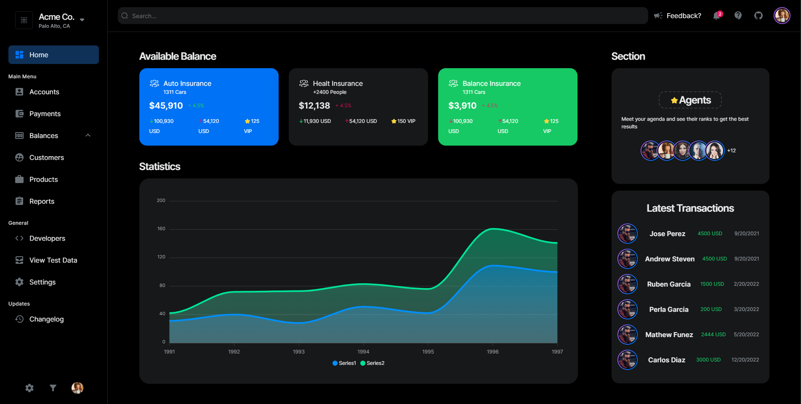
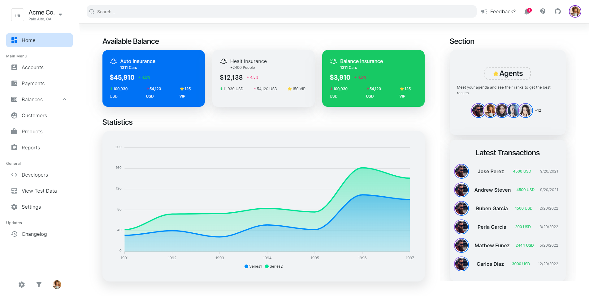

# NextJS and NextUI Dashboard Template Starter

You can deploy here directly to vercel [](https://vercel.com/import/project?template=https://github.com/Siumauricio/nextui-dashboard-template)


V1 Version Stitches https://v1-nextui-dashboard-template.vercel.app/
V1 Code: https://github.com/Siumauricio/nextui-dashboard-template/tree/v1

This is a template for NextJS and NextUI.

[NextJS](https://nextjs.org/)
[NextUI](https://nextui.org/)

You can see the demo here: https://nextui-dashboard-template.vercel.app/
For improve this template, you can create a pull request or open an issue here [Issues](https://github.com/Siumauricio/nextui-dashboard-template/issues) or [Pull Request](
    https://github.com/Siumauricio/nextui-dashboard-template/pulls)

### Dark Mode


### Light Mode



- Dark Mode Support
- Full Responsive
- Home Page with Charts
- Accounts Page
- More pages coming soon...

```
├── components
│   ├── accounts            # Accounts components
│   ├── charts              # Charts components
│   ├── breadcrumb          # component
|   ├── home                # Home components
|   ├── layout              # Layout components
|   ├── navbar              # Navbar components
|   ├── sidebar             # Sidebar components
|   ├── table               # Table components
|   ├── styles              # Some reusable components
|   ├── icons               # Icons
|   ├── hooks               # Hooks
├── app                     # Documentation files
│   ├── accounts            # Accounts route
|       ├── page.tsx        # Accounts page
│   ├── page.tsx            # Entry point for the app
│   ├── layout.tsx          # Layout applied to all application pages
│   ├── providers.tsx       # Theme provider
│   ├── more...             # Soon
└──
```

## For Run

Install dependencies


```bash
npm install
```

Start the server


```bash
npm run dev
```

Now you can visit https://localhost:3000 in your browser.

## Running with Docker

Create new image
```bash
docker build -t nextjs-docker .
```

Run the image
```bash
docker run -p 3000:3000 nextjs-docker
```

## NGINX Server

You can use the NGINX server to serve the application.

```bash
sudo vim /etc/nginx/sites-available/bagsiuesei-nextjs
```

```bash
server {
    listen 80; # listen of the default HTTP port 80
    server_name <Server IP>;  # Replace with your servers IP or domain name

    location / {
        proxy_pass http://localhost:3000; # Forward request to next.js app on port 3000 to port 80
        proxy_http_version 1.1;
        proxy_set_header Upgrade $http_upgrade;
        proxy_set_header Connection 'upgrade';
        proxy_set_header Host $host;
        proxy_cache_bypass $http_upgrade;
    }

    location /api/ {
        proxy_pass http://localhost:8000;  # Point to FastAPI app
        proxy_http_version 1.1;
        proxy_set_header Host $host;
        proxy_set_header X-Real-IP $remote_addr;
        proxy_set_header X-Forwarded-For $proxy_add_x_forwarded_for;
        proxy_set_header X-Forwarded-Proto $scheme;
    }
}
```

```bash
sudo ln -s /etc/nginx/sites-available/bagsiuesei-nextjs /etc/nginx/sites-enabled/
```

Check nginx syntax
```bash
sudo nginx -t
```

Restart nginx

```bash
sudo systemctl restart nginx
```
